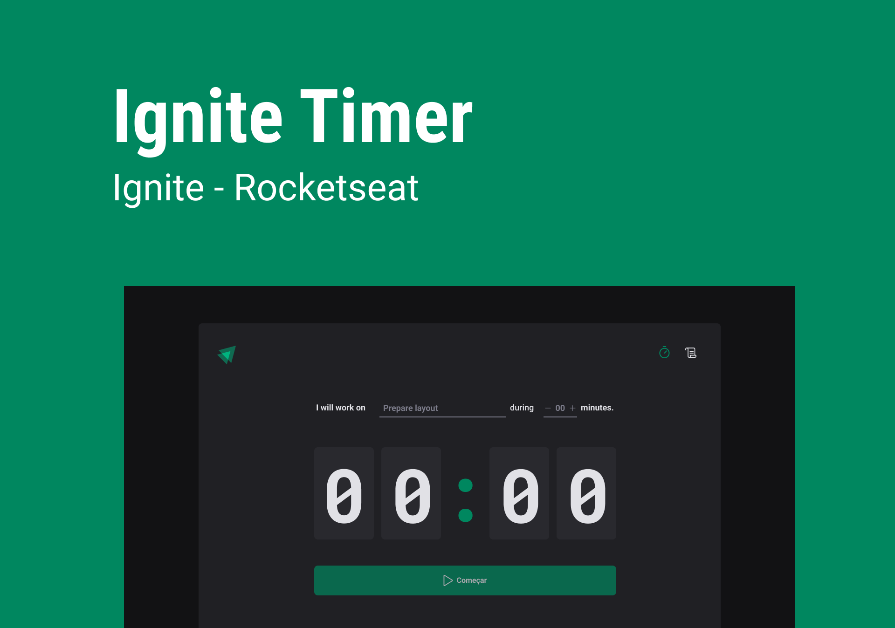

<div align='center'>
    <a href="https://viniokamoto.github.io/ignite-timer/">
        
    </a>
</div>

<h1 align='center'>
Ignite Timer
</h1>

 # 🌐 Check this out!
  - [Ignite timer](https://viniokamoto.github.io/ignite-timer/);

 # 💻 Project
 
Timer web application using React + Typescript. In this application, you can create your tasks and control the time spent in which one. When the timer over, you will be notified by a sound and a toast on top of the page.  
 
 # 🧪 Technologies

This project was developed using the following technologies:
- [ReactJS](https://pt-br.reactjs.org/);
- [ViteJS](https://vitejs.dev/);
- [Typescript](https://www.typescriptlang.org/);
- [Context API](https://pt-br.reactjs.org/docs/context.html);
- [React Router Dom](https://v5.reactrouter.com/web/guides/quick-start);
- [React Hook Form](https://react-hook-form.com/);
- [React Toastify](https://www.npmjs.com/package/react-toastify);
- [Styled Components](https://styled-components.com/);
- [immer](https://github.com/immerjs/immer);
- [Zod](https://github.com/colinhacks/zod);

# 🚀 How to install
Firstly, you will need [NPM 8.15.0](https://www.npmjs.com/) in your machine

Clone this repository and navigate to the project directory
```bash
$ git clone https://github.com/viniokamoto/ignite-timer.git
$ cd ignite-timer
```
Para iniciá-lo, siga os passos abaixo:
```bash
# To install the dependencies
$ npm i

# run the project in develop mode
$ npm run dev
```

After this you need to open your browser on the link provided in the terminal.

# 🎨 Layout
Layout devel
- [Layout Web](https://www.figma.com/file/kKw2mAFEH09qxgcbX6QbvQ/Ignite-Timer-(Community)?node-id=2%3A12)

# 📃 License
[MIT](https://choosealicense.com/licenses/mit/)